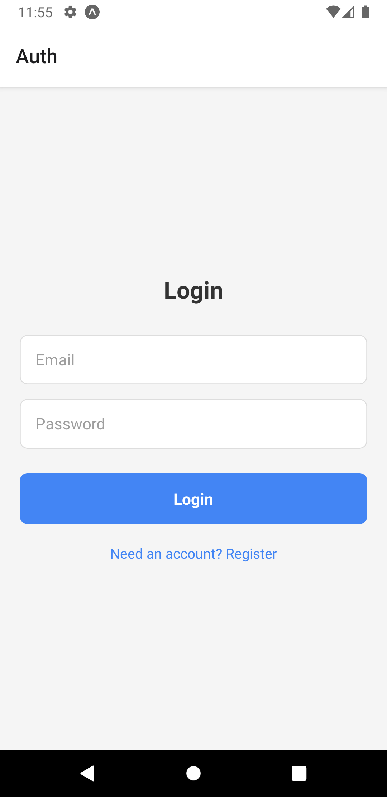
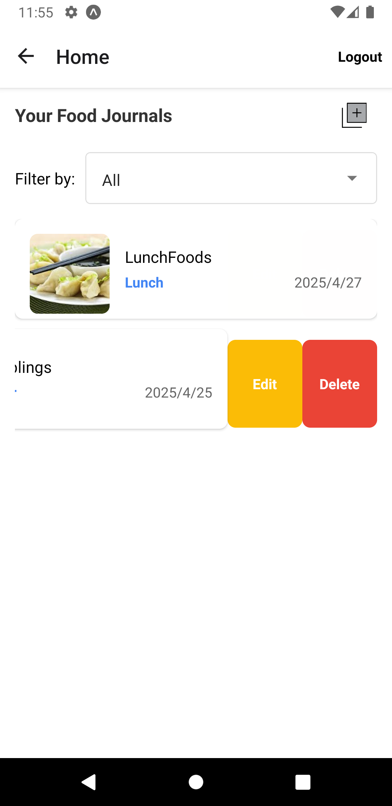
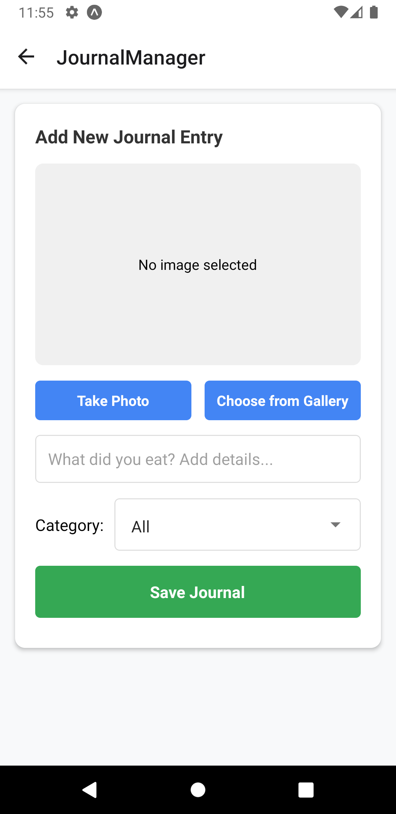

# Food Journal App

## Overview

Food Journal is a mobile application built using **React Native** and **Expo**. It allows users to manage their food journals by adding, editing, and deleting entries. Users can log in or register, view their journal list, and categorize entries by type (e.g., Breakfast, Lunch, Dinner, etc.). Each journal entry includes an image, description, category, and date.

## Features

### 1. **Login/Register Page**
- Users can log in or register using their email and password.
- Provides authentication functionality for secure access.

### 2. **Home Page**
- Displays the user's journal entries in a list format.
- Each journal entry includes:
  - **Image**: A thumbnail of the uploaded photo.
  - **Description**: A brief description of the journal.
  - **Category**: The food category (e.g., Breakfast, Lunch, Dinner).
  - **Date**: The date the journal was added.
- **Swipe Actions**:
  - Horizontal swipe reveals **Edit** and **Delete** buttons for each journal entry.
- **Navigation**:
  - Users can navigate to the **Journal Manager** page to add new entries.
  - Users can log out from the home page.
- **Filtering**:
  - Journals can be filtered by category (e.g., All, Breakfast, Lunch, etc.).

### 3. **Journal Manager Page**
#### **Add Journal**
- Allows users to create a new journal entry:
  - **Image Upload**:
    - Users can take a photo using the camera or choose an image from their gallery.
  - **Description**:
    - Add a text description for the journal.
  - **Category**:
    - Select a category from the dropdown menu: `All`, `Breakfast`, `Lunch`, `Dinner`, `Snacks`.
  - **Save**:
    - Save the journal entry to the database.

#### **Update Journal**
- Accessed via the **Edit** button on the Home page.
- Users can update all attributes of an existing journal entry:
  - Change the image.
  - Update the description.
  - Change the category.
  - Save the updated journal.

## Technologies Used

- **React Native**: Cross-platform mobile app development framework.
- **Expo**: Toolchain for building React Native apps with ease.
- **SQLite**: For user authentication and data storage.
- **React Navigation**: Handles navigation between screens.
- **React Native Swipe List View**: Enables swipeable rows for edit and delete actions.
- **React Native Image Picker**: Facilitates image uploads from the camera or gallery.
- **React Native Picker**: Dropdown menu for selecting categories.

## Installation

### Prerequisites
- Install [Node.js](https://nodejs.org/) and [npm](https://www.npmjs.com/).
- Install Expo CLI globally:
  ```bash
  npm install -g expo-cli
  ```

### Steps to Run the App
1. Clone the repository:
   ```bash
   git clone https://github.com/Eric-zeq/m2_FoodJournal.git
   cd m2_FoodJournal
   ```

2. Install dependencies:
   ```bash
   npm install
   ```

3. Start the Expo development server:
   ```bash
   npx expo start
   ```

4. Open the app on your device or emulator:
   - Use the [Expo Go app](https://expo.dev/accounts/ericzq/projects/foodJournalTracker/builds/79cb4843-535e-4dcf-ab60-14715ad51317) 
   - Scan the QR code.
   
   

## Folder Structure

```
├── assets/               # Images and other static assets
├── components/           # Reusable UI components
(auth,Database)
├── screens/              # Screen components (Auth, Home, JournalManager)
├── App.js                # Main entry point of the app
├── package.json          # Project dependencies
└── README.md             # This file
```

## Usage

1. **Login/Register**:
   - Enter your email and password to log in or register as a new user.

2. **Home Page**:
   - View your journal entries.
   - Use the filter dropdown to view entries by category.
   - Swipe left on an entry to edit or delete it.
   - Click the "+" button to add a new journal entry.

3. **Journal Manager Page**:
   - **Add Journal**:
     - Upload an image, add a description, select a category, and save.
   - **Edit Journal**:
     - Update an existing journal entry and save changes.

## ScreenShot




## Debug and Fix
[Content](extra/fixAnddebug.md)
